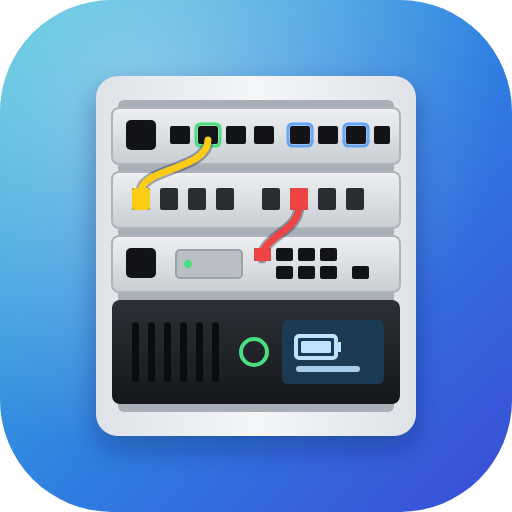
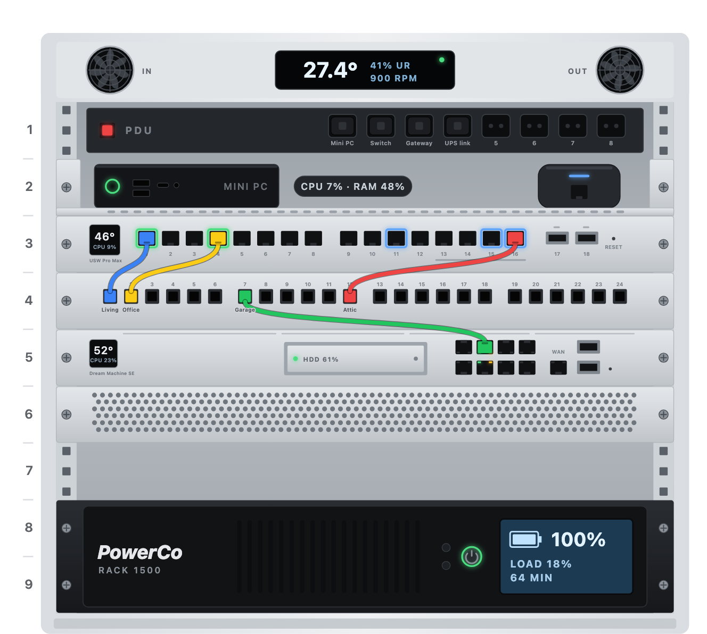
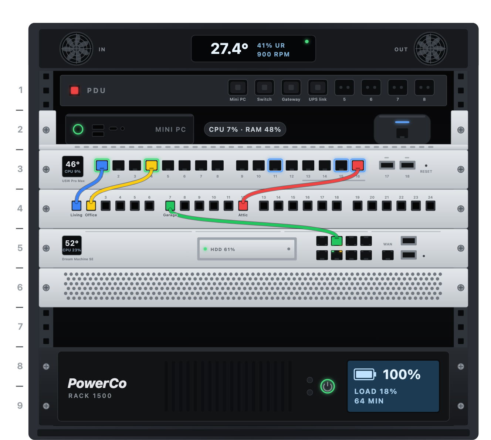

<p align="center"></p>

# Rack Card

> A to-scale front view of a network rack for Home Assistant dashboards. Every device is drawn in millimetres, its
> lights follow real entities, and tapping it opens its own pop-up.

Plain JavaScript in a single file, no build step, no external libraries. The visual editor is in Italian when the
Home Assistant frontend language is Italian, English otherwise.

<p align="center">
  
  
</p>

## What it does

- **To scale.** 1U is 44.45 mm and a panel is 482.6 mm wide, so devices keep their real proportions. Units are
  numbered from the top or from the bottom.
- **Devices.**
  - a switch modelled on the UniFi Switch Pro Max 16 PoE (touchscreen, 16 RJ45 in one row, 2 SFP+, Etherlighting);
  - a gateway modelled on the UniFi Dream Machine SE (touchscreen, HDD bay, 8 RJ45, WAN, 2 SFP+, port LEDs);
  - a patch panel (1 to 48 keystones) with a label and a cable colour for each port;
  - a PDU at the back of an open slot, with a label for each outlet;
  - a shelf with a mini PC on the left and an optional UniFi AI Port on the right;
  - a 2U UPS with its display (battery, load, runtime) and brand;
  - UniFi style aluminium blank and vented panels, or open slots.
- **Live lights.** Status LEDs, port lights (green link, blue PoE), the switch and gateway screens (temperature,
  CPU), the UPS display (amber on battery, red on fault) and the cooling fans, which spin at their real speed. A
  device whose status entity goes down gets a pulsing red outline.
- **Patch cables.** A patch panel port can be wired to any switch or gateway port: the card draws the cable in the
  chosen colour, with a plug at both ends.
- **Pop-ups.** Tapping a device navigates to its pop-up hash (for example `#rack-ups`, as Bubble Card pop-ups use),
  or runs any `tap_action`. Without a pop-up it opens the status entity.
- **Visual editor.** Every device, its position (a menu that shows what sits in each unit, plus up and down
  arrows), ports, labels, cables and entities can be set without YAML.

## Installation

### HACS

1. HACS → ⋮ → **Custom repositories** → `https://github.com/fedem95/rack-card`, type **Dashboard**.
2. Install **Rack Card** and reload the browser (on the Home Assistant app: Settings → Companion app → Debugging →
   Reset frontend cache).

### Manual

Copy `rack-card.js` to `/config/www/rack-card/` and add it as a dashboard resource (Settings → Dashboards → ⋮ →
Resources), type **JavaScript module**: `/local/rack-card/rack-card.js`.

## Setup

Add a card, pick **Rack Card** and build the rack in the visual editor, or start from YAML:

```yaml
type: custom:rack-card
units: 8
cooling:
  name: Cooling
  popup: "#rack-cooling"
  temperature: sensor.rack_temperature
  humidity: sensor.rack_humidity
  fan_in: sensor.rack_intake_fan_rpm
  fan_out: sensor.rack_exhaust_fan_rpm
  fault: binary_sensor.rack_fan_fault
devices:
  - type: pdu
    u: 1
    labels:
      1: Mini PC
      2: Switch
  - type: shelf
    u: 2
    name: Mini PC
    label: MINI PC
    popup: "#rack-server"
    status: binary_sensor.server_status
    cpu: sensor.server_cpu
    memory: sensor.server_memory
    ai_port:
      name: AI Port
      status: sensor.switch_port_11_poe_power
  - type: switch
    u: 3
    name: Switch
    popup: "#rack-switch"
    status: sensor.switch_state
    temperature: sensor.switch_temperature
    cpu: sensor.switch_cpu
    ports:
      1: { name: Living room, entity: binary_sensor.living_room_tv }
      11: { name: AI Port, entity: sensor.switch_port_11_poe_power }
  - type: patch
    u: 4
    ports: 24
    labels:
      1: { label: Living room, color: blue, link: "3:1" }
      2: Office
  - type: gateway
    u: 5
    name: Gateway
    popup: "#rack-gateway"
    status: sensor.gateway_state
    temperature: sensor.gateway_cpu_temperature
    cpu: sensor.gateway_cpu
    disk: binary_sensor.gateway_hdd_problem
    storage: sensor.gateway_storage
  - type: ups
    u: 7
    size: 2
    name: UPS
    brand: Brand
    label: MODEL-1500
    popup: "#rack-ups"
    status: sensor.ups_status
    battery: sensor.ups_battery
    load: sensor.ups_load
    runtime: sensor.ups_runtime
```

Free units are drawn as open slots (or panels, see `free_units`). Put the card in a sections view; it fills the
width it is given.

## Options

| Option | Description |
| --- | --- |
| `units` | Height of the rack in U. Default: the highest unit used. |
| `numbering` | `top` (U1 at the top, default) or `bottom`. |
| `free_units` | What fills the free units: `empty` (open slots, default), `blank` or `vented` panels. |
| `finish` | `light` (default) or `dark` rack. |
| `title` | Optional title above the rack. |
| `max_width` | Optional maximum width, e.g. `640px`. |
| `cooling` | The top of the rack: `temperature`, `humidity`, `fan_in`, `fan_out` (fan speed in rpm), `status`, `fault`, `sensor_fault`, `name`, `popup`. |
| `frame` | `false` draws the devices alone, without frame, cooling, rails, numbers and plinth, cropped to the faceplates. |
| `device_tap` | `false` turns off the tap on whole devices: the ports bound to an entity open a small panel instead (default `true`, `false` on a linked card). |

### Linked card

A second card can show some devices of a rack configured elsewhere, without repeating the configuration — for
example the switch alone at the top of its pop-up:

```yaml
type: custom:rack-card
from_view: server   # the view holding the main rack-card (omit to search the whole dashboard)
only: [3]           # the units to show
```

It reads the main rack-card of that view (also inside stacks, conditional cards and pop-ups) and follows it when the
dashboard is saved. With `only` it is drawn without frame and its devices do not react to a tap; its ports do. Any
other option written on the linked card (`frame`, `device_tap`, `finish`…) overrides the main one.

### Devices

Every device has `type`, `u` (its top unit) and optionally `size` (in U), `name`, `popup` (a hash such as
`#rack-ups`), `tap_action` and `status` (an entity whose `unavailable`, `off`, `disconnected`… marks the device as
down).

| Type | Extra options |
| --- | --- |
| `switch` | `temperature`, `cpu`, `caption`, `ports` (1–16, `sfp1`, `sfp2`). |
| `gateway` | `temperature`, `cpu`, `disk` (a problem sensor), `storage` (percent), `caption`, `ports` (1–8, `wan`, `sfp1`, `sfp2`). |
| `patch` | `ports` (number of ports, 1–48), `labels`. |
| `pdu` | `outlets` (1–12), `label`, `labels`. |
| `shelf` | `label`, `cpu`, `memory`, `ai_port` (`name`, `status`, `popup`, `tap_action`). |
| `ups` | `battery`, `load`, `runtime` (minutes), `brand`, `label` (the model). |
| `blank`, `vented`, `empty` | — |

**Ports** (`switch`, `gateway`) map a port to an entity, either `5: sensor.some_entity` or
`5: { name: Access point, entity: sensor.ap_state, poe: sensor.ap_poe_power }`: `entity` is the connected device
(any state, or a power sensor) and `poe` its PoE power in W. The port lights up green when the device is on, home,
connected or above zero, blue while it draws PoE. When ports are tappable (`device_tap: false`) a tap opens a panel
with the port, the device, its state, its PoE power and a button to its entity.

**Labels** (`patch`, `pdu`) map a port or outlet to a text, or for patch ports to
`{ label, color, link }`: `color` is the cable colour (`blue`, `grey`, `yellow`, `green`, `red`, `black`, `white`,
`orange`, `purple` or any CSS colour) and `link` wires it to a switch or gateway port as `"U:port"`, for example
`"3:12"` for port 12 of the device at U3. The editor keeps links in step when a device moves.

## Notes

- Pop-ups are not part of the card: it only navigates to their hash. Bubble Card pop-ups work as they are.
- Device drawings are modelled on real products, but the card does not depend on any integration: every light and
  value comes from the entities you choose.
- Missing or unavailable entities never break the card: their light goes off and their value shows "—".

## License

MIT
